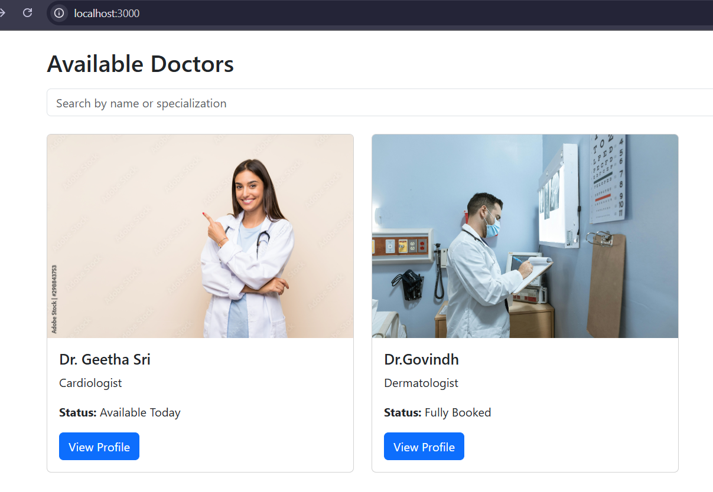
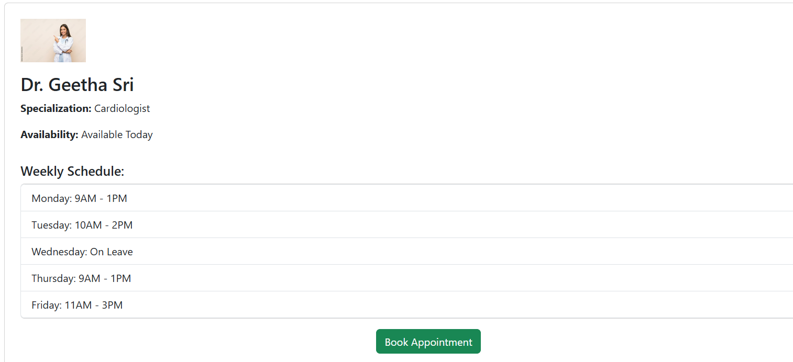
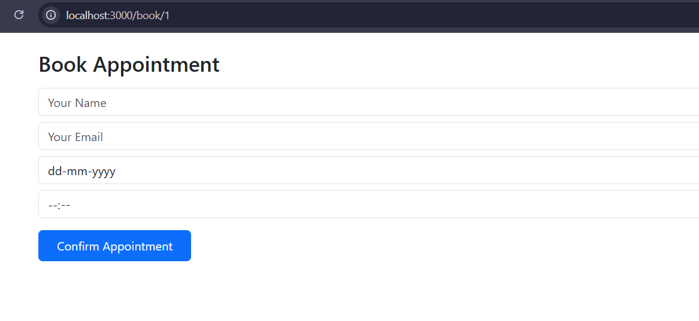

# 🏥 Healthcare Appointment Booking Web App

A responsive and user-friendly web application that allows patients to browse available doctors, view detailed doctor profiles, and book healthcare appointments easily.

---

## 🚀 Features

- 🔍 **Doctor Search** by name or specialization
- 👩‍⚕️ **Doctor Profiles** with availability & weekly schedule
- 📅 **Appointment Booking** with form validation
- ✅ **Confirmation Message** upon successful booking
- 📱 **Responsive Design** (mobile, tablet, desktop)
- 🌐 **Full Stack**: React.js frontend + Node.js/Express backend

---

## 🛠️ Tools & Libraries Used

### 🔹 Frontend
- **React.js** – UI development using functional components and hooks
- **React Router DOM** – Page navigation
- **Axios** – API communication with backend
- **Bootstrap** – Styling and responsive layout

### 🔹 Backend
- **Node.js** – JavaScript runtime
- **Express.js** – Lightweight server and API framework
- **CORS** – Middleware for cross-origin requests
- **body-parser** – To handle incoming request payloads
- **Local JSON (doctors.json)** – Sample doctor data stored on the server (`server/data/doctors.json`) and served via API

---

## 📂 Project Structure

```
project-root/
├── client/              # React Frontend
│   ├── public/images/   # Doctor profile images
│   ├── src/
│   │   ├── pages/       # Home, Profile, Booking pages
│   │   ├── styles/      # Custom CSS
│   │   └── App.jsx
├── server/              # Node.js Backend
│   ├── data/doctors.json
│   └── server.js
└── README.md
```

---

## 🗂️ Sample Data

The project uses sample doctor data stored in:

```
server/data/doctors.json
```

Each doctor entry includes:

- Name, specialization, profile image
- Availability status
- Weekly schedule

The frontend fetches this dynamically using Axios from an Express API.

---

## 💡 Improvements With More Time

If I had more time to work on this project, I would implement:

- 🗓️ **Dynamic Calendar View** to pick real-time slots
- 📧 **Email Notifications** for booking confirmation
- 🔐 **User Authentication**: Create a **Login and Sign-Up page** for patients
- 🧑‍⚕️ **Doctor Dashboard**: For managing availability and viewing bookings
- 🗃️ **Database Integration** (MongoDB or Firebase) instead of JSON

---

## ⚙️ Challenges Faced & Solutions

### 1. **Image Path Not Rendering From Backend**
- **Problem:** Images weren’t loading when using relative paths from backend.
- **Solution:** Moved profile images to `client/public/images` and used public path (`/images/filename.jpg`) so React can serve them statically.


### 2. **Form Validation Issues**
- **Problem:** Users could submit blank forms or invalid inputs.
- **Solution:** Added controlled inputs and validation checks using `useState`.

---

## 🧪 How to Run the Project Locally

### 1. Clone the Repository

```bash
git clone https://github.com/your-username/healthcare-appointment-app.git
cd healthcare-appointment-app
```

### 2. Install Dependencies

#### Backend
```bash
cd server
npm install
node server.js
```

#### Frontend
```bash
cd ../client
npm install
npm start
```

---

## 📸 Screenshots

### 🏠 Home Page


### 👩‍⚕️ Doctor Profile


### 📅 Booking Form



---

## 🙌 Acknowledgments

- Images from [Pexels](https://www.pexels.com) and [AdobeStock](https://stock.adobe.com/in/)


---

